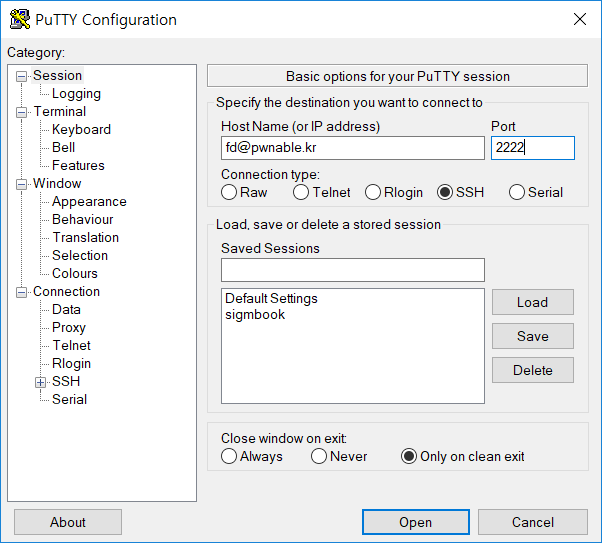
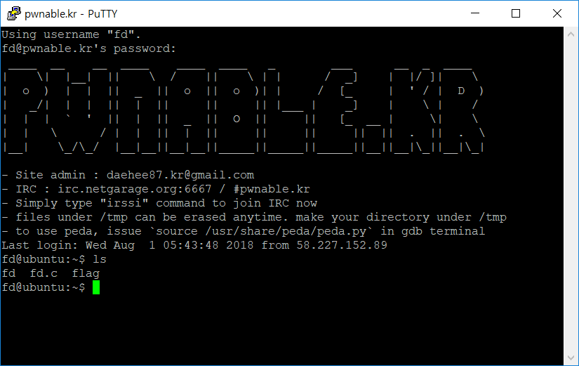
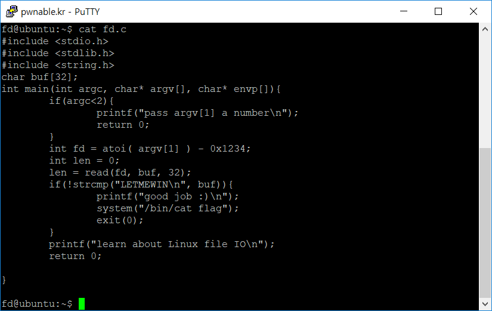
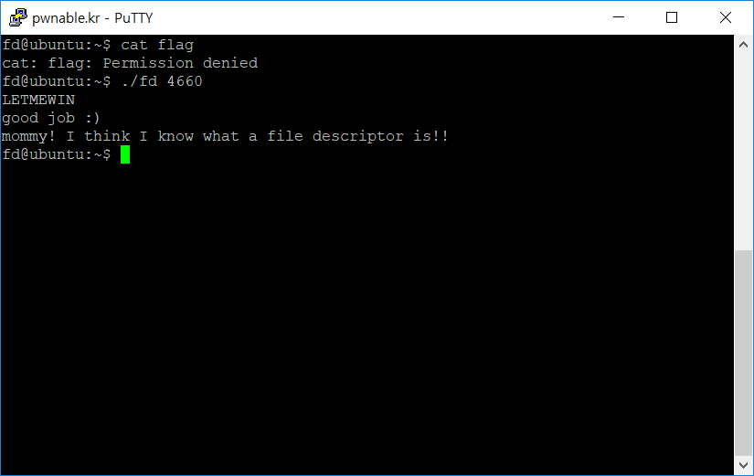
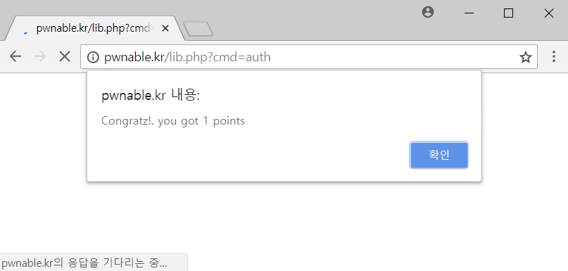

* putty 설치 및 접속

* 문제 확인
  - 보통 바이너리와 소스, flag가 주어짐
  - flag는 일반 유저권한에서 접근할 수 없으며, 주어진 바이너리에 setuid를 걸어놓아서, 바이너리를 정상실행했을때에 flag를 읽어서 출력하도록 해놓음

* 문제를 읽어보면 cmdline의 첫번째 인자(숫자)에서 0x1234(=4660) 만큼 뺀 file descriptor로부터 최대 32바이트를 읽어서 그 내용이 LETMEWIN 이면 플래그를 출력함
  - fd = 0은 stdin(키보드 입력)임. 따라서 fd = 0가 되게 만들면 내가 내용을 자유롭게 입력가능

* 정답 플래그인 mommy! ...를 사이트에 넣으면 정답여부가 출력되고 점수를 획득함

